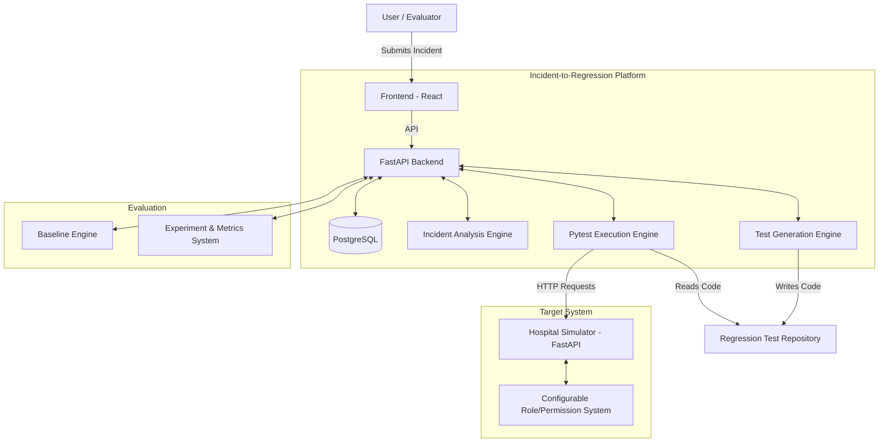
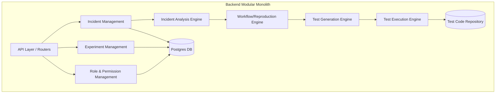
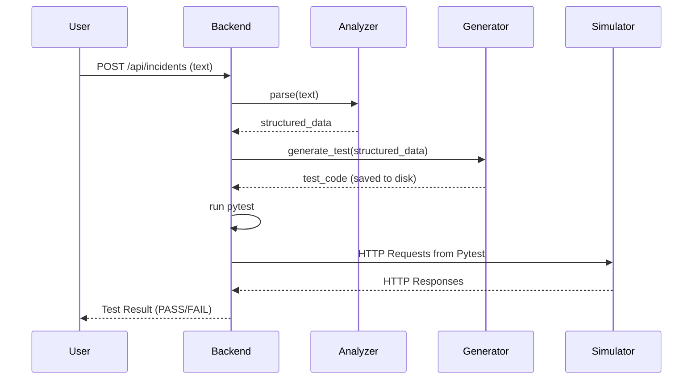
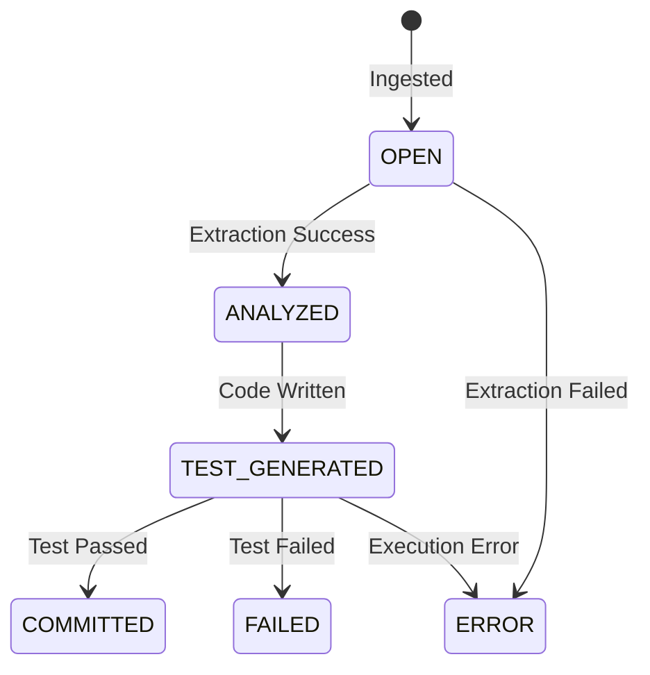
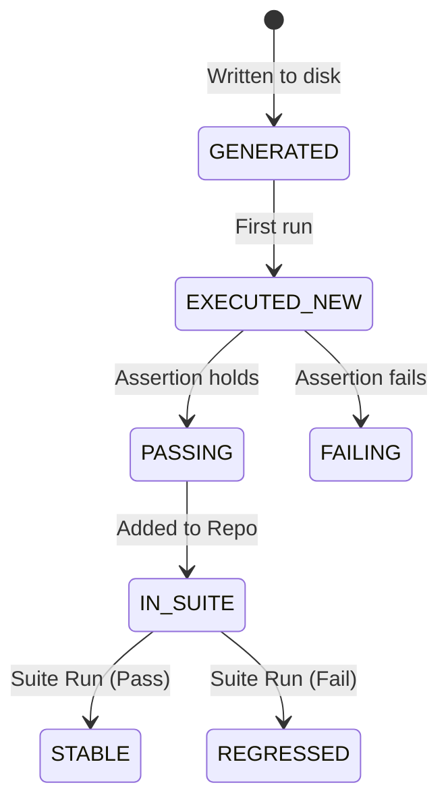
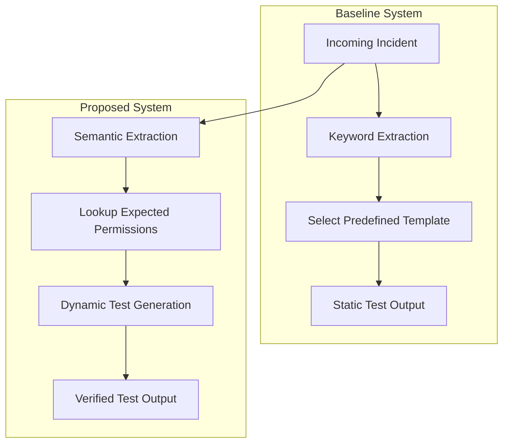
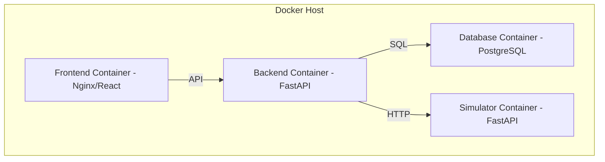

# System Architecture
# Incident-to-Regression Automation Platform

| Field         | Value                                      |
|---------------|--------------------------------------------|
| Project       | Incident-to-Regression Pipeline            |
| Domain        | Hospital Management System (Simulated)     |
| Version       | 1.0                                        |
| Status        | Draft                                      |
| Date          | August 2026                                |

---

## 1. System Overview

The Incident-to-Regression Automation Platform is designed to automate the conversion of production incidents into executable, passing regression tests. The system operates against a simulated Hospital Management System with permission-dependent workflows. 

The architecture is built as a **Modular Monolith** to maximize reliability, explainability, and maintainability for a college project, strictly avoiding unnecessary distributed system complexity.

The system is logically divided into four distinct boundaries:
1. **Hospital Application (Simulator):** The target system being tested.
2. **Incident-to-Regression Platform:** The core engine analyzing incidents and generating tests.
3. **Generated Regression Tests:** The output artifacts (executable Pytest code).
4. **Experiment/Baseline System:** The evaluation framework to compare the proposed solution against a naive baseline.

---

## 2. Problem-to-Solution Mapping

| Problem Area | Architectural Solution |
|--------------|------------------------|
| Complex permission-dependent workflows | Configurable Role and Permission System driven by YAML/DB |
| Real-world incident knowledge loss | Incident Analysis Engine to parse natural language to structured data |
| Lack of reliable regression tests | Regression Test Generation Engine outputting deterministic Pytest scripts |
| Need to verify fixes | Pytest Execution Engine running tests against the Hospital Simulator |
| Need for evaluation | Experiment System comparing Proposed Pipeline vs. Baseline |

---

## 3. High-Level Architecture

The high-level architecture separates the evaluation environment, the core pipeline, and the target hospital system.

---

## 4. Component Architecture

The backend is a modular monolith consisting of distinct domains.

### Component Details
- **Purpose:** Segregate logic by domain to maintain clean code boundaries while running in a single process.
- **Responsibilities:** Coordinate the pipeline stages, manage data persistence, and execute tests.
- **Dependencies:** PostgreSQL for data, local filesystem for test scripts.

---

## 5. Frontend Architecture

- **Technology:** React, TypeScript, Tailwind CSS
- **Purpose:** Provide a UI for users to submit incidents, view pipeline progress, and analyze experiment results.
- **Responsibilities:** Form validation, API communication, rendering dashboards, displaying test code and execution logs.
- **Dependencies:** Backend FastAPI.
- **Design Decisions:** Single Page Application (SPA) for snappy interactions. No complex state management (like Redux) needed; React Context/Hooks are sufficient.

---

## 6. Backend Architecture

- **Technology:** Python, FastAPI, Pydantic, SQLAlchemy
- **Purpose:** Serve as the core controller and orchestrator of the platform.
- **Responsibilities:** Expose RESTful APIs, manage DB transactions, orchestrate the Incident-to-Regression pipeline, and interface with the local filesystem to write/run tests.
- **Dependencies:** PostgreSQL, Pytest (via subprocess).
- **Design Decisions:** FastAPI provides automatic OpenAPI docs and asynchronous capabilities. SQLAlchemy allows standard ORM mapping.

---

## 7. Hospital Simulator Architecture

- **Purpose:** Serve as the "target" application for the regression tests.
- **Responsibilities:** Expose realistic endpoints (e.g., `/prescriptions`, `/patients`), enforce RBAC based on the configured roles.
- **Inputs:** HTTP requests from the Pytest Execution Engine.
- **Outputs:** HTTP responses (200 OK, 403 Forbidden, 404 Not Found, etc.).
- **Design Decisions:** The simulator can be built as a separate FastAPI instance or router within the same project. It must read its permission configurations dynamically.

---

## 8. Incident Management Architecture

- **Purpose:** Manage the lifecycle and storage of incidents.
- **Responsibilities:** CRUD operations for incidents, state tracking (OPEN, ANALYZED, TEST_GENERATED, etc.).
- **Inputs:** Raw incident text.
- **Outputs:** Structured incident records saved to the database.

---

## 9. Incident Analysis Engine

- **Purpose:** Understand raw incident text and extract structured entities.
- **Responsibilities:** Extract Role, Action, Expected Behavior, Actual Behavior, and Failure Category.
- **Dependencies:** Optional LLM integration boundary.
- **Important Design Decisions:** The engine will attempt rule-based or heuristic extraction first, falling back to an LLM if configured, ensuring the system can function without external APIs if needed.

---

## 10. Configurable Role and Permission System

- **Purpose:** Define what actions roles can perform in the Hospital Simulator.
- **Responsibilities:** Provide a mechanism to look up `Allow/Deny` decisions for a given `Role + Action`.
- **Inputs:** Configuration file (YAML) or DB records.
- **Important Design Decisions:** Must not be hard-coded. This allows the Experiment System to simulate "bugs" by dynamically altering permissions and testing if regressions are caught.

---

## 11. Workflow/Reproduction Engine

- **Purpose:** Translate structured incident data into concrete steps.
- **Responsibilities:** Map the `Action` to an HTTP endpoint (e.g., `Modify Prescription` -> `PATCH /api/prescriptions/{id}`).
- **Outputs:** An ordered list of logical reproduction steps.

---

## 12. Regression Test Generation Engine

- **Purpose:** Generate executable Python code.
- **Responsibilities:** Take reproduction steps and expected outcomes, and use Jinja2/string templating to generate a Pytest file.
- **Outputs:** `.py` files stored in the Test Repository.
- **Important Design Decisions:** Generated tests must be deterministic, human-readable, and use standard HTTP client libraries (like `httpx`).

---

## 13. Pytest Execution Engine

- **Purpose:** Run the generated tests against the Hospital Simulator.
- **Responsibilities:** Spawn a subprocess to run `pytest`, capture stdout/stderr, parse the output (e.g., via JUnit XML or JSON report).
- **Outputs:** Execution status (PASS/FAIL/ERROR) and logs.

---

## 14. Regression Test Repository

- **Purpose:** Store passing regression tests permanently.
- **Responsibilities:** Maintain a directory of `.py` files on the local filesystem.
- **Important Design Decisions:** Tests are stored on the filesystem (not in the DB) so they can be run directly by Pytest natively. The DB tracks metadata (test ID, associated incident, path).

---

## 15. Metrics and Experiment System

- **Purpose:** Evaluate the platform against the primary KPI.
- **Responsibilities:** Run batch experiments (Baseline vs Proposed), record conversion rates, execution times, and false positives.
- **Outputs:** JSON payloads for the Frontend dashboard.

---

## 16. Database Architecture

- **Technology:** PostgreSQL
- **Key Entities:**
  - `Incident`: ID, raw_text, status, extracted_data
  - `RegressionTest`: ID, incident_id, file_path, status, last_run_at
  - `ExperimentRun`: ID, type (baseline/proposed), total_incidents, successful_conversions, metadata

---

## 17. API Architecture

RESTful principles using FastAPI:
- `POST /api/incidents` - Submit incident
- `GET /api/incidents/{id}` - Get incident status
- `POST /api/incidents/{id}/process` - Trigger pipeline
- `GET /api/tests` - List tests
- `POST /api/tests/run-all` - Execute suite
- `POST /api/experiments/run` - Trigger evaluation

---

## 18. Data Flow

---

## 19. Incident Lifecycle

---

## 20. Regression Test Lifecycle

---

## 21. Authentication and Authorization Flow

Within the test execution context:
1. The generated test script reads the required `Role` from its setup phase.
2. The script requests a mock authentication token from the Simulator (e.g., `POST /auth/login {role: "Nurse"}`).
3. The Simulator returns a JWT or dummy token.
4. The test attaches this token to the `Authorization: Bearer` header of the target request.
5. The Simulator middleware validates the token, extracts the role, and evaluates the RBAC rules.

---

## 22. Baseline Architecture

- **Purpose:** Serve as the control group.
- **Workflow:** Regex/Keyword matching -> Select from predefined templates -> Generate Test.
- **Limitations:** No semantic understanding, no RBAC lookups, fails on novel phrasing.

---

## 23. Proposed Architecture

- **Workflow:** Semantic parsing -> RBAC validation -> Dynamic step generation -> Execution.
- **Advantages:** Adapts to variations in text, generates context-aware assertions, handles edge cases intelligently.

---

## 24. Baseline vs Proposed Architecture

---

## 25. Error Handling

- **Parse Errors:** If an incident lacks enough context, it remains OPEN with an error note.
- **Test Generation Errors:** Invalid mappings result in a log and the test is marked ERROR.
- **Test Execution Errors:** Pytest crashes or timeouts are caught by the execution subprocess wrapper and reported back to the API.

---

## 26. Human-Review Workflow

To prevent fully automated chaos, the platform supports an optional Human-in-the-Loop:
1. Pipeline generates test.
2. Status changes to `REVIEW`.
3. User inspects generated Pytest code via WebUI.
4. User clicks "Approve & Execute" or modifies the code before execution.

---

## 27. Configuration Strategy

- **System Config:** Environment variables (e.g., `DATABASE_URL`, `LLM_API_KEY`).
- **RBAC Config:** `roles.yaml` and `permissions.yaml` mapped to application memory on startup, allowing easy tampering for experiments (e.g., intentionally breaking a rule to test the pipeline).

---

## 28. Optional LLM Integration Boundary

- **Usage:** Strictly confined to the `Incident Analysis Engine` for text parsing.
- **Interface:** A defined Python protocol (e.g., `parse_incident(text: str) -> IncidentModel`).
- **Safety:** The LLM does NOT generate code directly. It only outputs JSON. The `Test Generation Engine` uses deterministic Jinja2 templates based on that JSON. This guarantees tests are safe and syntactically valid.

---

## 29. Security Considerations

- **Simulator Isolation:** The simulator only runs locally for the project. No real patient data is used.
- **Subprocess Execution:** Pytest runs via `subprocess`. While arbitrary code execution is a risk in test generation, confining generation to strict Jinja2 templates mitigates this.

---

## 30. Deployment Architecture

*Note: For simplicity, Backend and Simulator can share a container, but logically they are separate.*

---

## 31. Local Development Architecture

- **Tools:** Docker Compose for spinning up Postgres. Hot-reloading via `uvicorn` for Backend and Vite/CRA for Frontend.
- **Workflow:** Developers can run the pipeline step-by-step using Swagger UI (`/docs`).

---

## 32. Scalability Considerations

- As a college prototype, horizontal scalability is not required.
- The modular monolith design allows for future extraction of the Simulator or the Analysis Engine into separate microservices if needed.

---

## 33. Hardware/Free-Tier Constraints

- Designed to run on a standard student laptop (8GB RAM).
- LLM usage (if any) relies on free-tier APIs (e.g., Gemini API free tier).
- PostgreSQL is lightweight enough for local Docker.

---

## 34. Technology Choices and Rationale

| Technology | Justification |
|------------|---------------|
| **React/TS** | Industry standard, typed, easy to build dashboards quickly. |
| **FastAPI** | Fast, built-in validation via Pydantic, auto-generates API docs, ideal for Python data engineering. |
| **Pydantic** | Crucial for validating the structured data extracted from incidents. |
| **PostgreSQL** | Reliable relational database; ideal for tracking incident and test states. |
| **Pytest** | Standard Python testing framework; outputs machine-readable results easily. |
| **Docker Compose** | Ensures the environment works uniformly for demonstration and grading. |

---

## 35. Architectural Trade-offs

- **Filesystem Test Storage vs Database:** We store `.py` files on disk rather than entirely in the DB. *Trade-off:* Harder to cluster, but vastly simplifies running Pytest locally.
- **Monolith vs Microservices:** *Trade-off:* Combines Simulator and Pipeline into one repo. Reduces network overhead and deployment complexity, which is optimal for a one-week project.
- **Template Generation vs LLM Code Generation:** *Trade-off:* Using Jinja templates is less flexible than having an LLM write raw code, but it guarantees syntactic correctness and execution safety.

---

## 36. Design Limitations

- The system can only generate tests for workflows predefined in its mapping dictionary (e.g., it knows how to test `Modify Prescription`, but not a completely novel feature without an update to the generator).
- Pytest execution assumes the Simulator is reachable via `localhost`.

---

## 37. Future Extension Points

- **CI/CD Integration:** Automatically running the regression suite on GitHub Actions.
- **Advanced State Management:** Simulating complex hospital states (e.g., patient admission histories) before running a test.
- **Log Parsing:** Extending the Analysis Engine to accept application logs instead of just text descriptions.

---

## Architecture Decision Summary

1. **Modular Monolith:** Chosen to maximize deliverability and maintainability within the college project timeframe. Microservices were explicitly rejected.
2. **Deterministic Test Generation:** The pipeline uses LLMs (optionally) *only* for semantic extraction (Text -> JSON). The actual code generation (JSON -> Pytest) is deterministic via Jinja2 templates. This ensures safety and reliability.
3. **Filesystem Test Repository:** Test scripts are written directly to disk to leverage Pytest's native discovery and execution features, avoiding the need for a custom in-memory test runner.
4. **Simulator Separation:** The Hospital Simulator is logically separated (though possibly running in the same Docker network) to act as a true black-box target for the regression tests.
5. **Config-Driven RBAC:** Permissions are loaded dynamically so the Experiment System can intentionally introduce "bugs" (permission flaws) to validate the pipeline's effectiveness.
